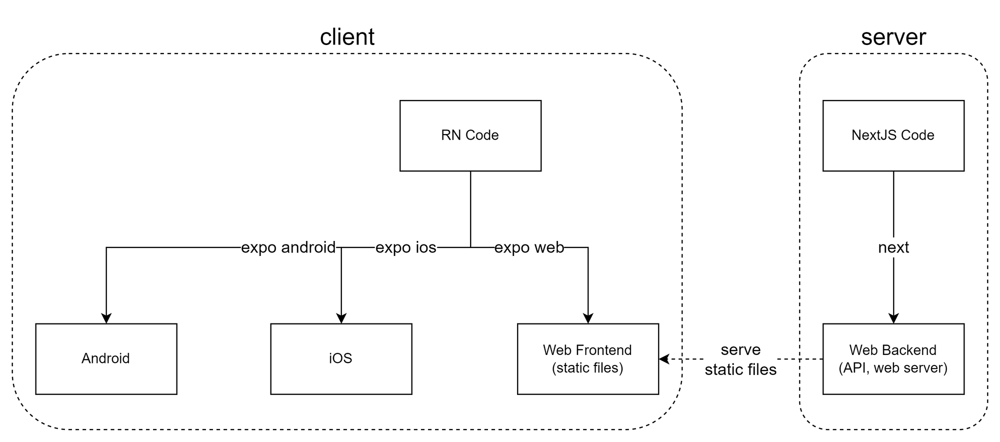

# 구조

## server (NextJS)

> 주의! NextJS의 React 프레임워크로서의 기능은 사용하지 않습니다. (일반적인 Backend 기능만 수행합니다.)

- API 서버 역할을 수행합니다.
- client(Expo)에서 생성된 Web Frontend 정적 파일(HTML, JS 등)을 serve합니다.

## client (Expo)

> 주의! Web Frontend는 server(NextJS)가 아닌 client에서 빌드합니다.

- Android, IOS App을 빌드합니다.
- Web Frontend를 빌드합니다.

# 설치 및 실행

- server, client의 README 참고
