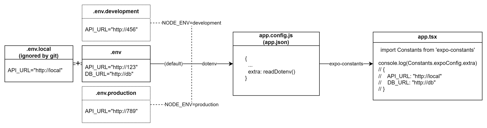

# 시작하기

'시작하기' 항목은 이 repo를 clone한 후, 최초 1번만 수행하면 됩니다.

## 의존성 설치

```bash
yarn install
```

## (optional) GraphQL API URL 설정

- GraphQL API URL은 기본적으로 http://localhost:3000/api/graphql 입니다.
- Expo Go 사용 등을 이유로 URL 변경 필요 시, `.env.local` 파일을 통해 변경할 수 있습니다. ([참고: 환경변수 설정](#로컬에-맞게-변경))

# 의존성 추가

```bash
yarn expo install package-name
```

- expo package의 경우 expo install로 설치해야 합니다.
- 일반 npm package의 경우도 expo install이 내부적으로 yarn을 호출해 설치됩니다.

# 실행

## Expo go 사용 시 (Android, IOS)

1. expo 개발서버 실행
   ```bash
   yarn start
   ```
   - 개발서버의 URL과 QR Code가 터미널에 출력됩니다.
   - 일반적으로 19000번 포트에서 개발서버가 실행됩니다.
2. Android, IOS 기기에서 Expo Go 앱을 실행하고,<br/>
   `Scan QR Code` 혹은 `Enter URL Manually`을 통해 개발서버에 연결합니다.

## Android 에뮬레이터, 혹은 USB로 직접 Android 기기 연결 시

```
yarn run android
```

## IOS 에뮬레이터, 혹은 USB로 직접 IOS 기기 연결 시

```
yarn run ios
```

## Web

```
yarn run web
```

- 일반적으로 19006번 포트에 개발서버가 실행됩니다.

# 빌드

TODO: ESA 사용

# 환경변수 설정



## 기본값

- .env 파일에 기본 환경변수가 설정되어 있습니다.

## 로컬에 맞게 변경

- .env.local 파일을 생성해 .env 파일의 환경변수를 덮어 쓸 수 있습니다.
- \*.local 파일은 git에 의해 무시되므로, 로컬에서만 필요한 환경변수를 설정할 때 유용합니다.

## 코드에서 읽기

```javascript
import Constants from 'expo-constants'

console.log(Constants.expoConfig!.extra!.API_URL)
```

## development, production 시 환경변수 설정

- development, production시 따로 환경변수를 지정 할 수도 있습니다.

  ```bash
  NODE_ENV=production expo start

  ```

# 프로젝트 생성 과정

> 주의!<br/>이 문단은 기록용이므로, 아래 명령어를 따라하실 필요는 없습니다.

> 이 repo를 clone한 경우에는 [시작하기](#시작하기) 항목을 따라주시기 바랍니다.

1. create-next-app의 template으로 생성
   ```bash
   yarn create expo-app --template
   # navigation(Typescript) 템플릿 선택
   ```
2. expo-for-web 사용을 위해 의존성 설치
   ```bash
   yarn expo install @expo/webpack-config
   ```
3. 환경변수(`.env` 파일) 사용 설정
   - dotenv-flow 설치
     ```
     yarn expo install dotenv-flow
     ```
   - dotenv-flow로 `.env` 파일에서 환경변수 읽음
   - `app.config.js`의 `extra` 필드로 환경변수 전달
4. Expo 프로젝트에 Apollo Client 추가
   - 의존성 설치
     ```bash
     yarn expo install @apollo/client graphql
     ```
   - `App.tsx`에 client 설정

# 참고자료

## Expo

- [create-expo-app](https://docs.expo.dev/get-started/create-a-new-app)

## 환경변수

- [Environment Variable in Expo](https://docs.expo.dev/guides/environment-variables/)
- [dotenv-flow](https://github.com/kerimdzhanov/dotenv-flow)

## Apollo Client

- [React + Apollo Client Tutorial](https://www.howtographql.com/react-apollo/1-getting-started/)
- [Apollo Client 공식문서: integration with RN](https://www.apollographql.com/docs/react/integrations/react-native/)
